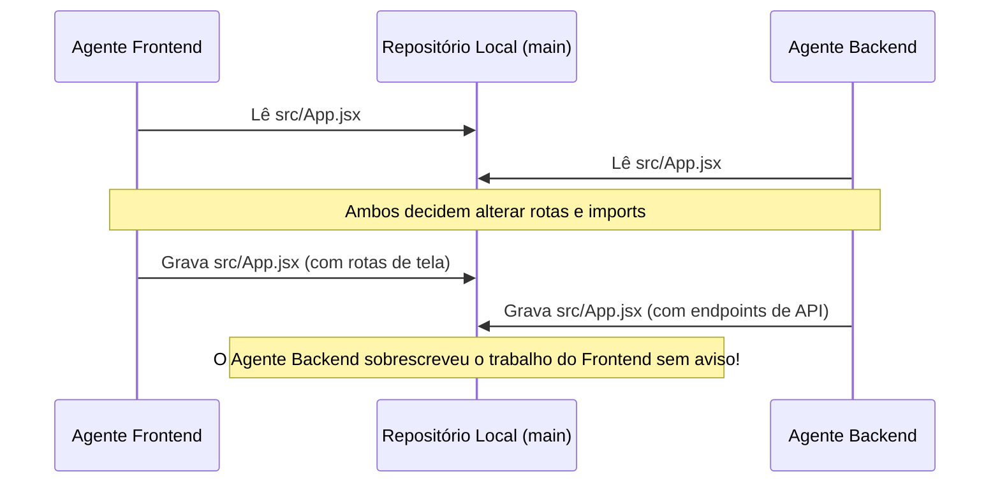

# Deep Dive: Orquestração de Agentes de Inteligência Artificial

> **Documento Teórico e Arquitetural de Referência**  
> **Baseado na análise detalhada do vídeo:** [*Pare de Usar 1 Agente de IA Por Vez: Orquestre Agentes de IA*](https://youtu.be/8jvrucR7QCU) de **Kauã Miguel (Dev / @kc_1t)** e no estado da arte de sistemas multi-agentes.

---

## 1. A Metáfora da Orquestra e o Fim do Agente Solitário

Tradicionalmente, a interação com Inteligências Artificiais e modelos de linguagem (LLMs) tem sido serial e monolítica: o usuário abre uma janela de chat ou uma sessão de terminal e delega uma tarefa complexa a um único agente (ex: Claude Code, OpenAI Codex, Antigravity, Aider).

Esse modelo rapidamente atinge um teto de produtividade e confiabilidade:
- **Sobrecarga Cognitiva do Modelo**: Um único agente tentando modelar o schema do banco de dados, implementar regras de negócio em Python, criar interfaces em React, gerar testes unitários e redigir documentação sofre com rápida degradação da sua **janela de contexto**. Instruções anteriores são "esquecidas" ou diluídas pela atenção difusa (*attention drift*), aumentando a frequência de alucinações.
- **A Metáfora Musical**: *Orquestrar* vem do conceito de uma orquestra sinfônica. Em vez de um músico solitário correr entre violino, violoncelo, trompete e percussão, uma orquestra possui especialistas dedicados que tocam juntos em sincronia, sob uma regência central (o Maestro) ou sob uma partitura compartilhada.

---

## 2. O Verdadeiro Gargalo: O Desenvolvedor Humano

Um dos insights centrais explorados por Kauã Miguel é a assimetria cognitiva entre a máquina e o ser humano:

> *"A IA não cansa. Quem cansa é você, que só consegue olhar para um terminal de cada vez. No fim, o gargalo da produtividade vira o humano, e não o agente."*

Quando você opera agentes em série, passa a maior parte do tempo em **"Alt-Tab Hell"**: aguardando o agente terminar de rodar testes ou compilar um arquivo para então fornecer o próximo prompt. Enquanto você lê a resposta de um, os outros recursos computacionais ficam ociosos. 

A orquestração paralela inverte essa lógica: múltiplos agentes executam simultaneamente tarefas independentes enquanto o desenvolvedor atua como supervisor de alto nível (Product Owner / Tech Lead), aprovando pull requests e avaliando relatórios consolidados.

---

## 3. O Espectro da Orquestração: Do Simples ao Complexo

A orquestração não é um conceito binário ("você orquestra ou não"). Ela se manifesta em um espectro contínuo de complexidade e maturidade de ferramentas:

```
[Nível 1: Subagents Nativos] 
        ↓
[Nível 2: Múltiplos Terminais & Abas Paralelas]
        ↓
[Nível 3: Desktop Workspaces & Kanban de Agentes]
        ↓
[Nível 4: ADE - Agent Development Environment]
```

### Nível 1: Subagents Nativos
- **Exemplos**: Claude Code com ferramenta de subagents, Google Antigravity chamando subagentes de pesquisa/execução, OpenAI Codex com delegação interna.
- **Como Funciona**: O agente raiz identifica que uma subtarefa requer exploração ou isolamento e invoca um agente filho subordinado dentro da mesma sessão.
- **Vantagens**: Sem necessidade de ferramentas externas; integração transparente com o modelo principal.
- **Limitações**: Isolamento fraco entre ecossistemas diferentes (um Claude não invoca nativamente um Codex com facilidade) e compartilhamento arriscado do mesmo diretório local.

### Nível 2: Múltiplos Terminais e Abas
- **Como Funciona**: O desenvolvedor divide a tela do terminal em 3 ou 4 painéis (ex: tmux, Windows Terminal com tabs) e roda um agente em cada aba (ex: Aba 1: backend, Aba 2: frontend, Aba 3: testes).
- **Vantagens**: Flexibilidade absoluta; utiliza as CLIs nativas que o desenvolvedor já domina.
- **Limitações**: Falta de persistência estruturada; alto esforço cognitivo manual para sincronizar o progresso de cada aba.

### Nível 3: Workspaces e Apps de Gerenciamento
- **Exemplos**: **Alethe** (open source), **CodeAgentSwarm**, **Claude Squad**.
- **Como Funciona**: Aplicativos desktop desenvolvidos especificamente para gerenciar múltiplas instâncias de agentes de IA em uma interface gráfica ou terminal unificado, com acompanhamento de cotas, histórico persistente e quadros Kanban.

### Nível 4: ADE (Agent Development Environment)
- **Exemplo Principal**: **Orca** (`onorca.dev`).
- **O Salto de Paradigma**: Assim como a indústria transitou de editores de texto simples (Notepad, nano) para IDEs completas (VS Code, IntelliJ) para apoiar desenvolvedores humanos, a indústria está agora transitando de chats simples para **ADEs** concebidas para gerenciar frotas de agentes.
- **Características de uma ADE**:
  - Delegação cruzada entre modelos de provedores distintos (Anthropic, OpenAI, Google, modelos locais).
  - Automação integrada de **Git Worktrees**.
  - Monitoramento de branches, diffs em tempo real e suítes de teste automatizadas.
  - Interface remota mobile para supervisão assíncrona.

---

## 4. O Desafio Fundamental da Concorrência: Conflito de Arquivos

O maior risco técnico ao colocar múltiplos agentes de IA para trabalhar simultaneamente no mesmo projeto é a **condição de corrida (Race Condition) no sistema de arquivos**:



Se dois agentes operam na mesma pasta física ao mesmo tempo sem isolamento:
1. Eles leem o mesmo arquivo em momentos ligeiramente diferentes.
2. Cada um faz edições baseadas na sua própria visão local.
3. O segundo agente a salvar **sobrescreve silenciosamente** as edições do primeiro.
4. O desenvolvedor só descobre o desastre horas depois ao analisar diffs quebrados ou erros de compilação bizarros.

---

## 5. A Solução Canônica: Isolamento de Workspace via Git Worktree

A solução elegante da engenharia de software para esse problema é o uso de **Git Worktrees**.

### O que é Git Worktree?
Uma funcionalidade nativa do Git que permite ter **múltiplas árvores de trabalho vinculadas ao mesmo repositório local**, onde cada diretório de trabalho aponta para uma branch diferente de forma totalmente independente:

```bash
# Cria uma cópia isolada na pasta .worktrees/feature-front apontando para a branch feature-front
git worktree add ../.worktrees/feature-front -b feature-front

# Cria outra cópia isolada para o agente de backend
git worktree add ../.worktrees/feature-back -b feature-back
```

### Arquitetura com Worktree:
```
meu-projeto/ (branch: main)
├── .worktrees/
│   ├── feature-front/    ──> Agente Frontend trabalha aqui (Sem tocar no Backend)
│   ├── feature-back/     ──> Agente Backend trabalha aqui (Sem tocar no Frontend)
│   ├── feature-db/       ──> Agente de Banco modela migrations
│   └── feature-qa/       ──> Agente Crítico roda testes e linters
```

### Vantagens do Isolamento:
- **Zero Colisão**: Cada agente pode criar, deletar e modificar arquivos livremente em seu diretório sem interferir nos demais.
- **Reconciliação Estruturada**: Ao concluir sua tarefa, o agente faz commit em sua branch. A integração na branch `main` passa por um processo formal de Pull Request ou merge automático com validação de testes.

---

## 6. Análise Comparativa das Ferramentas do Vídeo

| Ferramenta | Criador / Origem | Paradigma | Destaques & Diferenciais | Repositório / Link |
| :--- | :--- | :--- | :--- | :--- |
| **Alethe** | Kauã Miguel (Dev / Vídeo) | Terminal-Centric Workspace | Interface limpa, foco em terminais persistentes, controle de limites de tokens de Claude/Codex, **Remote Control via celular por QR Code**, 100% Open Source. | [GitHub](https://github.com/Kc1t/alethe-agents) |
| **Orca** | Orca Team (`onorca.dev`) | ADE Completo | Suporte cruzado a múltiplos modelos (Claude chamando Codex), gerenciamento nativo de Git Worktrees, visualizador de diffs e PRs, Orca CLI e app mobile. | [Site Oficial](https://www.onorca.dev) |
| **CodeAgentSwarm** | CodeAgentSwarm | Desktop Workspace | Interface desktop com **Kanban visual integrado**, atribuição direta de cards para agentes e painel de métricas de consumo de tokens. | [Site Oficial](https://www.codeagentswarm.com) |
| **Claude Squad** | smtg-ai | Terminal Puro | Organização ágil direto no terminal para orquestrar Claude Code, Codex e Aider sem sobreposição de arquivos. Leve e rápido. | [GitHub](https://github.com/smtg-ai/claude-squad) |
| **Maestro** | The Maestri Team (macOS) | Infinite Canvas | Mesa de trabalho visual estilo **Figma/Canva**, permitindo posicionamento espacial livre de terminais e fluxos de agentes. | [Site Oficial](https://themaestri.app) |
| **Awesome Agent Orchestrators** | Comunidade (andyrewlee) | Catálogo Curado | Repositório agregando **mais de 150 ferramentas** e frameworks de orquestração de agentes em contínua expansão. | [GitHub](https://github.com/andyrewlee/awesome-agent-orchestrators) |

---

## 7. Modos de Operação: Human-in-the-Loop vs Modo YOLO

Kauã Miguel destaca a importância da transição controlada de autonomia:

1. **Modo Supervisionado (Human-in-the-Loop)**:
   - O agente solicita confirmação antes de executar comandos de terminal potencialmente destrutivos (`rm`, `git reset`, comandos de deploy).
   - Indicado para projetos em início de estruturação ou ao testar novos modelos de linguagem.
2. **Modo YOLO (Unrestricted / Autonomous)**:
   - O agente recebe carta branca para executar comandos, instalar pacotes e editar arquivos sem aguardar confirmações manuais.
   - **Atenção**: O modo YOLO só é seguro quando combinado com:
     - **Isolamento de Git Worktree** (para conter eventuais estragos).
     - **Agente Crítico de Testes** (que executa suítes automatizadas antes de qualquer merge).

---

## 8. Conclusão: A Fase "Pré-VS Code" dos Agentes

Estamos vivenciando um momento histórico singular no ecossistema de software:
- Ainda **não existe uma convenção universal rígida** ou um padrão monopolista para como agentes de IA devem ser organizados.
- Da mesma forma que os anos 90 e 2000 viram a evolução de dezenas de ferramentas até a consolidação de gigantes como o Visual Studio Code, os próximos anos definirão a ADE definitiva da engenharia de software autônoma.
- Experimentar diferentes abordagens (subagents, terminais múltiplos, Alethe, Orca) é a melhor forma de encontrar o fluxo que maximiza a velocidade do desenvolvedor e o poder computacional da IA.
